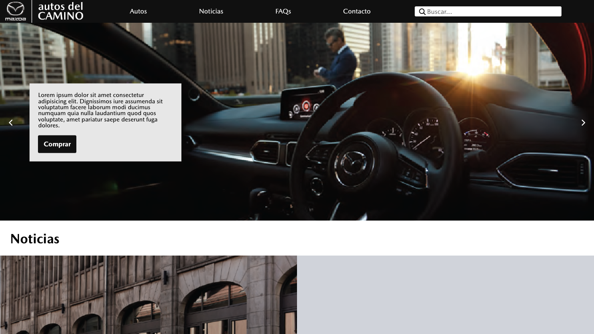
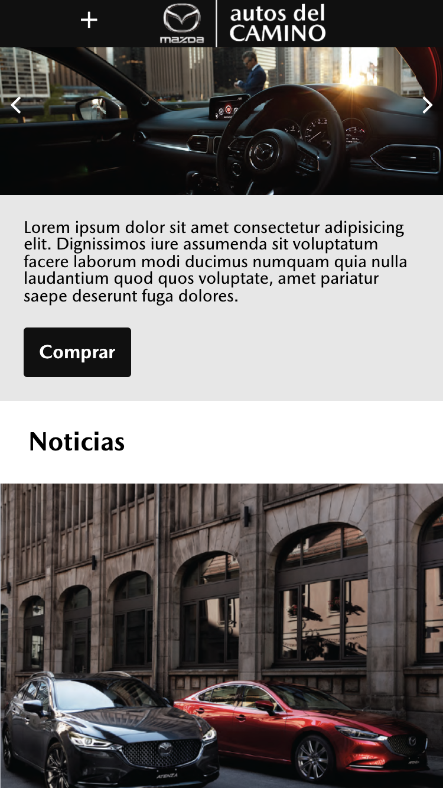

# Maqueta "Autos del Camino"

La empresa Autos del Camino requería realizar el diseño de su logo y de su sitio web, con el propósito de adaptarse a las nuevas tendencias de diseño web, de acuerdo a esto y aplicando buenas prácticas del desarrollo web en conjunto con el manual de marca del cliente, se ha realizado esta maqueta con la estructura y los elementos requeridos.

## Link demo del proyecto

[Demo maqueta Autos del Camino](https://autos-toshow.surge.sh/)

## Pasos requeridos para instalar y visualizar el proyecto

1. Para descargar este proyecto, copie el enlace del repositorio.
2. Ejecute 'git clone' añadiendo el enlace después de clone.
3. Se descargará la carpeta con los archivos.
4. Sin cambiar la estructura de las carpetas, abre el archivo "index.html" en el navegador de su preferencia.
5. ¡Listo!

## Ejemplo gráfico del proyecto

Así se debería ver en los siguientes dispositivos

### Versión escritorio

### Versión mobile

## Contacto

Cualquier inquietud puede ser consultada en el correo <alejocarmona93@gmail.com> o al télefono +573004469954